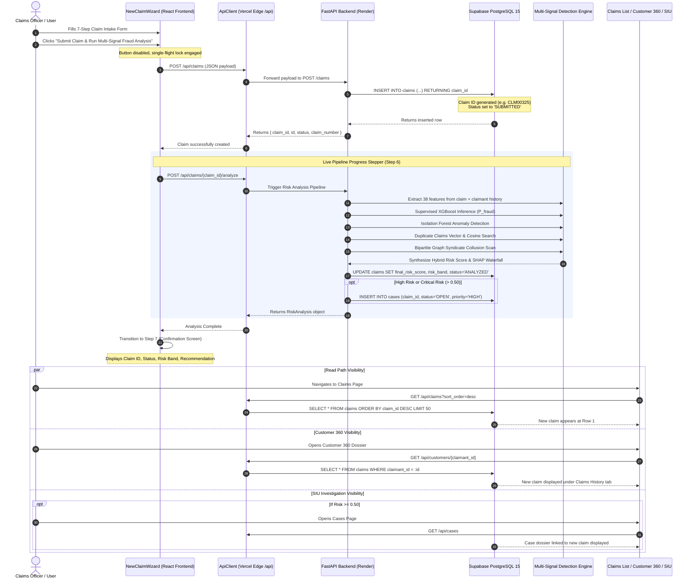

# Claim Submission & Lifecycle Data Flow Specification
**Project:** Graph-Enhanced Insurance Claim Anomaly and Duplicate Network Detection  
**Document:** End-to-End Claim Intake, Analysis, Storage, and Visibility Pipeline

---

## 1. Overview
This document specifies the exact lifecycle of an insurance claim from initial intake through machine learning risk scoring, database persistence, and cross-application visibility.

---

## 2. End-to-End Data Flow Sequence

---

## 3. Storage Architecture & Schema Mapping

### 3.1 Primary Claim Record (`claims` table)
- **Primary Key:** `claim_id` (`VARCHAR(32)`, e.g., `CLM00325`)
- **Foreign Keys:**
  - `claimant_id` -> `customers(claimant_id)`
  - `policy_id` -> `policies(policy_id)`
  - `provider_id` -> `providers(provider_id)`
- **Key Columns Inserted:**
  - `claim_date`: Date of loss
  - `claim_type`: Collision, Theft, Fire, etc.
  - `claim_amount`: Total financial exposure
  - `incident_severity`: Minor, Major, Total Loss
  - `status`: Lifecycle status (`SUBMITTED` -> `ANALYZED` -> `UNDER_REVIEW` -> `APPROVED` / `REJECTED`)
  - `final_risk_score`: Float between `0.00` and `1.00`
  - `risk_band`: `LOW`, `MEDIUM`, `HIGH`, `CRITICAL`
  - `fraud_label`: Ground truth or high-confidence flag (`0` or `1`)

### 3.2 Machine Learning & Explanation Storage
- **Supervised ML Output:** Evaluated on 38 tabular features (`age_of_policyholder`, `incident_hour_of_the_day`, `vehicle_claim`, `injury_claim`, `property_claim`, `witnesses`, `police_report_available`).
- **Anomaly Detection Output:** Isolation Forest anomaly score representing outlier distance in n-dimensional feature space.
- **Duplicate Detection Matches:** Evaluates cross-claim cosine similarity across VINs, incident times, and claimant pairs.
- **Graph Topology Subnetwork:** Analyzes bipartite graph entities (Claimant, Claim, Vehicle, Provider, Policy) to detect dense cycles, shared repair shops, and organized syndicate fraud rings.
- **SHAP Explanation:** Saved with feature contributions indicating exact drivers pushing risk up (`INCREASES_RISK`) or down (`REDUCES_RISK`).

---

## 4. UI Visibility Guarantees
1. **Claims List (`/claims`):** Claims are retrieved via `GET /claims?sort_order=desc&sort_by=claim_id`. The newly inserted claim is returned at index 0 and rendered at the top of the table.
2. **Customer 360 (`/customers`):** Clicking a customer opens their dossier and calls `GET /customers/{claimant_id}`. The new claim is dynamically listed under the **Claims History** tab with status, amount, and link to view details.
3. **Dashboard (`/`):** Claim creation automatically invalidates the `/dashboard` in-memory cache, causing the Total Claims KPI and Claim Amount metrics to reflect the new record.
4. **Investigation Cases (`/cases`):** If the hybrid risk score exceeds `0.50`, an SIU case is auto-provisioned and visible under open investigations.
