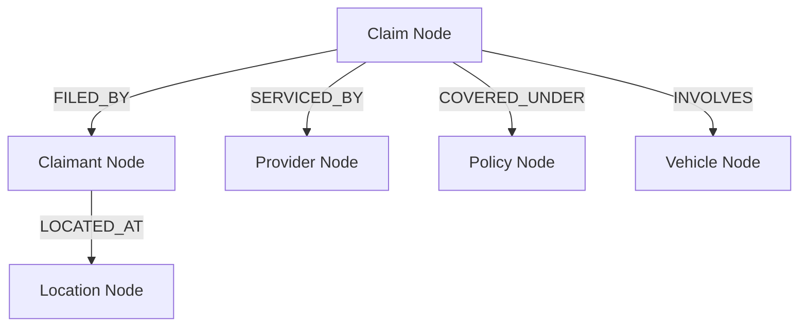

# FraudShield AI — Graph Analytics & Collusion Ring Methodology

This document details the theory, architecture, and implementation of the heterogeneous knowledge graph engine used in FraudShield AI to uncover organized insurance fraud syndicates and collusion networks.

---

## 1. Why Graph Analysis for Insurance Fraud?

Traditional tabular machine learning models evaluate insurance claims in isolation:
$$\text{Claim } i \rightarrow \mathbf{x}_i \rightarrow \hat{y}_i$$

However, organized insurance fraud is fundamentally relational:
* **Staged Accidents**: Corrupt body shops, medical providers, and claimants repeatedly interact across unrelated policies.
* **Identity Recycling**: Synthetic claimants share telephone numbers, addresses, or bank accounts.
* **Provider Collusion**: A specific repair shop inflates invoices across hundreds of small fender-benders.

By representing entities and interactions as a heterogeneous graph $G = (V, E, \tau_v, \tau_e)$, structural anomalies and dense collusion clusters become computationally visible.

---

## 2. Graph Schema & Entity Types

The knowledge graph incorporates 5 distinct node types connected by 4 typed relationship edges:

### Node Types ($\tau_v$)
1. **Claim** (`type='claim'`): The central transaction node containing `claim_amount`, `claim_date`, `claim_type`.
2. **Claimant** (`type='claimant'`): Policyholder or third-party filing the claim.
3. **Provider** (`type='provider'`): Repair facility, hospital, or towing contractor.
4. **Policy** (`type='policy'`): Underlying insurance contract.
5. **Vehicle** (`type='vehicle'`): Automobile involved in the incident.

### Edge Types ($\tau_e$)
* `FILED_BY`: Connects `Claim` $\leftrightarrow$ `Claimant`
* `SERVICED_BY`: Connects `Claim` $\leftrightarrow$ `Provider`
* `COVERED_UNDER`: Connects `Claim` $\leftrightarrow$ `Policy`
* `INVOLVES`: Connects `Claim` $\leftrightarrow$ `Vehicle`

---

## 3. Network Feature Engineering

From the constructed network, four critical topological metrics are extracted per claim node and merged into the machine learning feature vector:

### A. Degree Centrality ($C_D$)
Measures the direct connectivity of the claim's associated entities:
$$C_D(v) = \frac{\text{deg}(v)}{|V| - 1}$$
High degree indicates shared entities across an abnormally high volume of claims.

### B. PageRank ($PR$)
Computes structural importance through recursive edge voting:
$$PR(u) = \frac{1-d}{|V|} + d \sum_{v \in B_u} \frac{PR(v)}{L(v)}$$
Entities associated with known fraudulent actors receive elevated PageRank through link propagation.

### C. Betweenness Centrality ($C_B$)
Quantifies how often an entity falls on the shortest path between other entities:
$$C_B(v) = \sum_{s \ne v \ne t} \frac{\sigma_{st}(v)}{\sigma_{st}}$$
High betweenness identifies "broker" providers or ringleaders bridging distinct clusters.

### D. Collusion Ring Score ($R_{\text{collusion}}$)
Measures the density of bipartite cycles between claimants and providers:
$$R_{\text{collusion}} = \frac{\text{Shared Neighbors}(C_i, P_j)}{\max(\text{deg}(C_i), \text{deg}(P_j))}$$
Values approaching 1.0 indicate closed, recurring collusion rings.

---

## 4. API & Visualization Service

* **Sub-Graph Extraction**: `GET /api/graph/claim/{claim_id}` returns the 2-hop ego network for any claim, including node attributes and edge weights.
* **Collusion Ring Discovery**: `GET /api/graph/rings` extracts high-density connected components using Louvain community detection.
* **Frontend Interactive Rendering**: Uses SVG and Canvas force-directed graph physics with intuitive zoom, pan, and node inspection.
