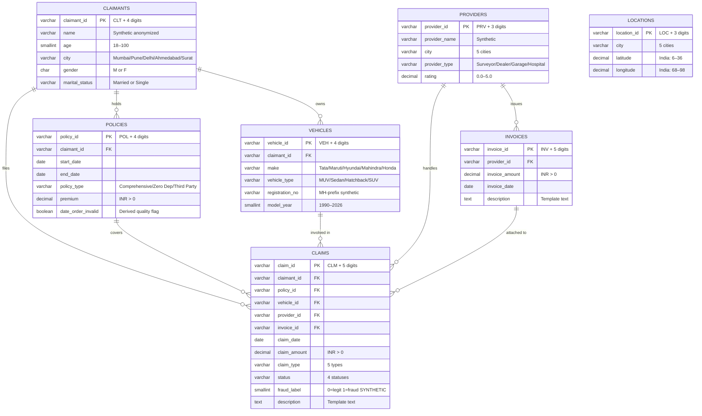

# Entity Relationship Documentation
## Graph-Enhanced Insurance Claim Fraud Detection

**Version:** 1.0.0
**Data:** Synthetic project-generated (not real insurance data)

---

## ER Diagram (Mermaid)



> **Note:** `LOCATIONS` is not connected in this ER diagram because it has no FK from any other table. The only join path is city string matching.

---

## Relationship Details

### CLAIMANTS → POLICIES (One-to-Many)

| Attribute | Value |
|---|---|
| Join | `policies.claimant_id = claimants.claimant_id` |
| Cardinality | 1 claimant : 1–4 policies |
| Claimants with policies | 84 of 120 |
| Claimants without policies | 36 (hold no policy but may still appear in claims via cross-FK) |
| Average policies per claimant | 1.67 |

**Semantics:** A claimant purchases one or more insurance policies. Each policy has its own premium, coverage period, and type.

---

### CLAIMANTS → VEHICLES (One-to-Many)

| Attribute | Value |
|---|---|
| Join | `vehicles.claimant_id = claimants.claimant_id` |
| Cardinality | 1 claimant : 1–4 vehicles |
| Claimants with vehicles | 79 of 120 |
| Average vehicles per claimant | 1.65 |

**Semantics:** A claimant owns one or more vehicles registered in their name.

---

### CLAIMANTS → CLAIMS (One-to-Many)

| Attribute | Value |
|---|---|
| Join | `claims.claimant_id = claimants.claimant_id` |
| Cardinality | 1 claimant : 1–7 claims |
| Claimants with claims | 113 of 120 |
| Average claims per claimant | 2.83 |

**Semantics:** A claimant files one or more claims. Multiple claims by the same claimant is a fraud signal (serial claimant pattern).

---

### POLICIES → CLAIMS (One-to-Many)

| Attribute | Value |
|---|---|
| Join | `claims.policy_id = policies.policy_id` |
| Cardinality | 1 policy : 1–7 claims |
| Policies with claims | 120 of 140 |
| Average claims per policy | 2.67 |

**Semantics:** Multiple claims can be filed under the same policy. High claim frequency under a single policy is a fraud signal.

---

### VEHICLES → CLAIMS (One-to-Many)

| Attribute | Value |
|---|---|
| Join | `claims.vehicle_id = vehicles.vehicle_id` |
| Cardinality | 1 vehicle : 1–N claims |

**Semantics:** The same vehicle can appear in multiple claims (e.g., repeated theft claims for the same vehicle).

---

### PROVIDERS → INVOICES (One-to-Many)

| Attribute | Value |
|---|---|
| Join | `invoices.provider_id = providers.provider_id` |
| Cardinality | 1 provider : 1–N invoices |

**Semantics:** A provider issues invoices for services rendered.

---

### PROVIDERS → CLAIMS (One-to-Many)

| Attribute | Value |
|---|---|
| Join | `claims.provider_id = providers.provider_id` |
| Cardinality | 1 provider : 1–N claims (25 providers, 320 claims) |

**Semantics:** A provider handles many claims. High provider degree is a fraud concentration signal.

---

### INVOICES → CLAIMS (One-to-Many, Non-standard)

| Attribute | Value |
|---|---|
| Join | `claims.invoice_id = invoices.invoice_id` |
| Cardinality | 1 invoice : 1–7 claims |
| Unique invoices across 320 claims | 167 |
| Claims sharing an invoice | 153 |

> [!WARNING]
> **Non-standard relationship.** In a real system, each claim would have its own invoice. Here, a single `invoice_id` is referenced by multiple claims. This is a **source-data characteristic** preserved exactly. In graph analysis, shared invoices are a fraud detection signal (potential collusion or invoice reuse scheme).

---

### LOCATIONS (Orphaned — No FK)

| Attribute | Value |
|---|---|
| Rows | 60 |
| Cities covered | Mumbai (16), Delhi (13), Surat (13), Ahmedabad (10), Pune (8) |
| Join path | City string match only |

**Semantics:** Provides lat/lon for each city. Can be joined to `claimants.city` or `providers.city` for geospatial features but has no FK. The same 5 cities appear in claimants, providers, and locations tables (consistent set).

---

## Fraud Signal Summary (Graph-Detectable)

| Signal | Relationship | Indicator |
|---|---|---|
| Serial claimant | CLAIMANTS → CLAIMS | High claimant degree (many claims) |
| Ring fraud | CLAIMANTS shared via POLICIES/VEHICLES | Claimants in same connected component |
| Provider concentration | PROVIDERS → CLAIMS | High provider degree or betweenness centrality |
| Invoice reuse / collusion | INVOICES → CLAIMS (shared) | Invoice_id referenced by ≥2 claims |
| Policy over-claiming | POLICIES → CLAIMS | Many claims per policy |
| Vehicle reuse | VEHICLES → CLAIMS | Same vehicle in multiple claim types |
| Provider-claimant ring | PROVIDERS ←→ CLAIMANTS via CLAIMS | Dense subgraph in bipartite projection |

---

## Seed / Import Order

Load tables in this order to satisfy FK dependencies:

```
1. claimants     (no FK dependencies)
2. providers     (no FK dependencies)
3. policies      (FK → claimants)
4. vehicles      (FK → claimants)
5. invoices      (FK → providers)
6. claims        (FK → claimants, policies, vehicles, providers, invoices)
7. locations     (no FK dependencies; orphaned)
```

---

## SQL: Create All Tables

See [`database/schema.sql`](../database/schema.sql) for the full PostgreSQL-compatible DDL.
See [`database/seed.py`](../database/seed.py) for the SQLite seed script.
See [`database/views.sql`](../database/views.sql) for analytical views.
See [`database/indexes.sql`](../database/indexes.sql) for performance indexes.

---

*Generated as part of Phase 2: Relational Insurance Data Model.*
*All statistics are computed from `data/relational/` (which is derived from `data/processed/`).*
